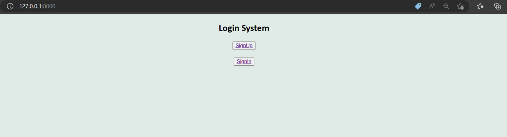
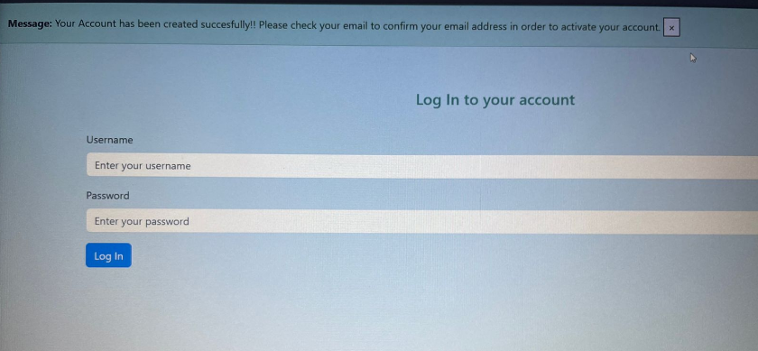
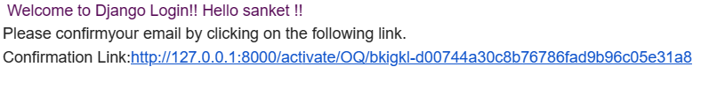
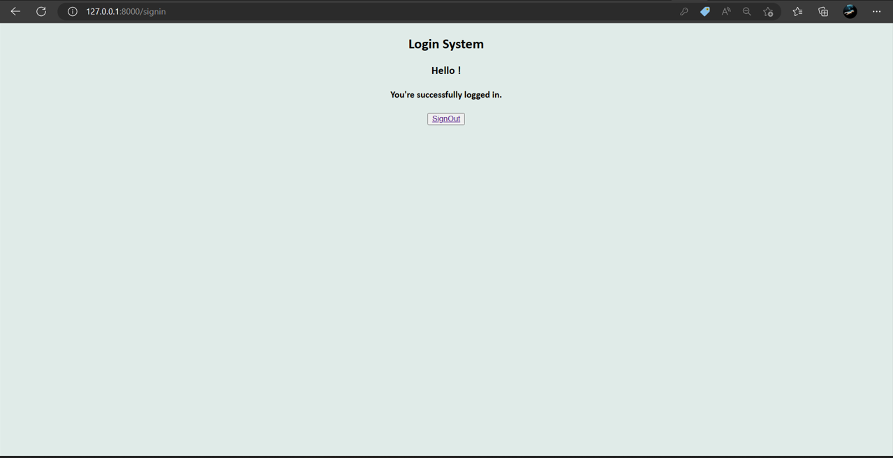

# Django Login and Register

Django project with basic user functionality.

## Screenshots

| Home | Create an account | Activation |
| -------|--------------|-----------------|
|  |  |  |

| Email Verification | Log In | Log out |
| ---------------|------------------|-----------------|
|  |  |  |

## Functionality
-Sign Up
- Create an account
- Email Verification
- Activate profile
- Log in
    - via username & password
- Log out

